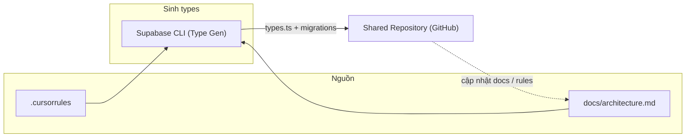

# Architecture — Thiết lập & Đồng bộ

## Luồng Thiết lập & Đồng bộ

Luồng bắt đầu từ quy tắc dự án và tài liệu kiến trúc, qua Supabase CLI (sinh types), rồi đồng bộ qua Git.



- **.cursorrules**: Rule chung cho AI và dev (stack, cấu trúc, quy ước).
- **docs/architecture.md**: Mô tả kiến trúc và luồng này.
- **docs/database-schema.md**: Tóm tắt schema DB; chi tiết SQL ở `supabase/migrations/`.
- **supabase/migrations/**: Single Source of Truth cho mọi thay đổi DB (migration SQL).
- **supabase/types.ts**: Types TypeScript sinh từ DB qua Supabase CLI; không sửa tay.

## Sử dụng

| Việc cần làm | Hành động |
|--------------|-----------|
| Hiểu quy ước dự án | Đọc `.cursorrules` và `docs/architecture.md`. |
| Xem schema DB | Đọc `docs/database-schema.md`; SQL đầy đủ trong `supabase/migrations/`. |
| Thay đổi DB | Thêm file migration mới trong `supabase/migrations/`, áp dụng (Dashboard hoặc `supabase db push`), rồi chạy gen types. |
| Cập nhật types sau khi đổi schema | Chạy `npm run gen:types` (cần set env `SUPABASE_PROJECT_ID` hoặc sửa script trong package.json với project ref), hoặc lệnh trong header của `supabase/types.ts`; commit `supabase/types.ts`. |

### Lệnh gen types (ghi trong `supabase/types.ts`)

```bash
npx supabase gen types typescript --project-id <project-ref> -o supabase/types.ts
# hoặc (CLI đã cài): supabase gen types typescript --project-id <project-ref> -o supabase/types.ts
```

Project ref lấy từ Supabase Dashboard (URL project hoặc Settings → General).
